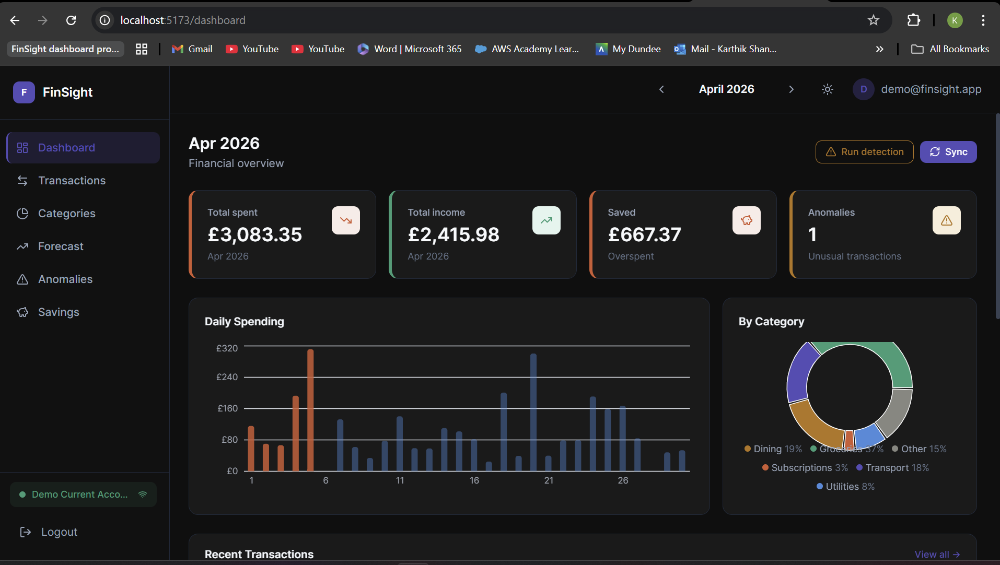
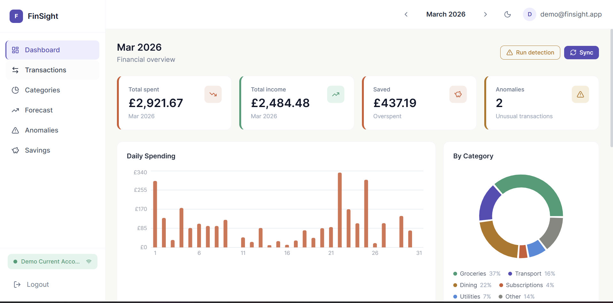
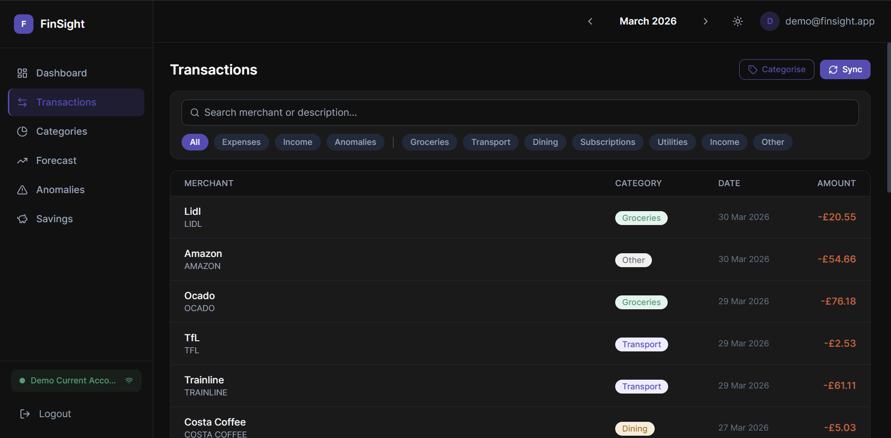
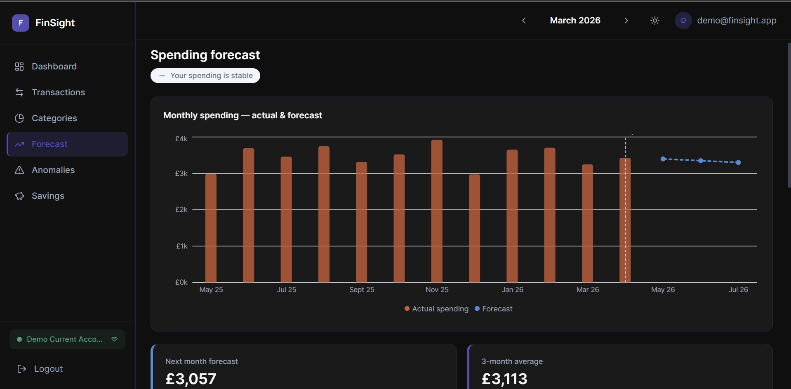
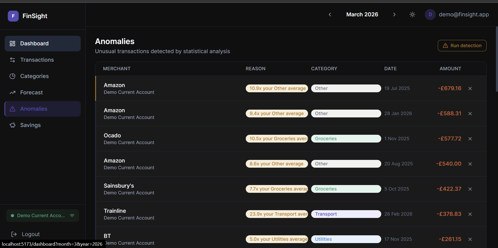
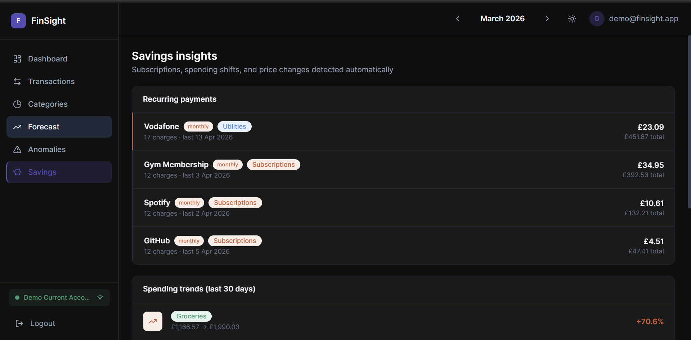
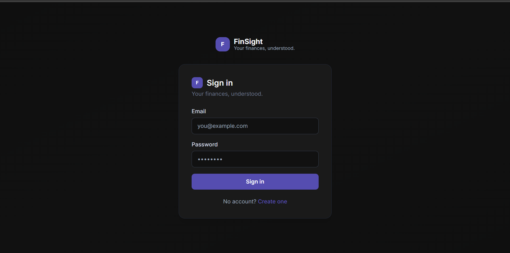

# FinSight — Personal Finance Dashboard

> AI-powered personal finance dashboard with Open Banking integration, 
> automatic transaction categorisation, anomaly detection, and spending forecasts.

**Live Demo:** https://fin-sight-flax.vercel.app  
**Demo credentials:** demo@finsight.app / demo123

## Screenshots

### Dashboard (Light & Dark mode)



### Transactions


### Spending Forecast


### Anomaly Detection


### Savings Insights


### Login


## Features
- **Open Banking** via TrueLayer OAuth2 — connect real UK bank accounts
- **Smart categorisation** — rule-based engine with LLM fallback (OpenRouter/Mistral)
- **Anomaly detection** — statistical flagging using 2σ method
- **Spending forecast** — exponential smoothing with trend adjustment
- **Subscription detection** — automatically identifies recurring payments
- **Price increase alerts** — detects when subscription costs rise
- **Dark/light mode** — full theme support
- **JWT authentication** — secure email/password auth

## Tech Stack

| Layer | Technology |
|-------|-----------|
| Backend | FastAPI, SQLAlchemy, PostgreSQL |
| Frontend | React, Vite, Tailwind CSS, Recharts |
| Auth | JWT (python-jose) |
| Open Banking | TrueLayer API |
| LLM | OpenRouter (Mistral 7B) |
| Deployment | Render (backend), Vercel (frontend) |

## Local Development

### Prerequisites
- Python 3.11+
- Node.js 18+
- TrueLayer sandbox account (free)
- OpenRouter account (free)

### Backend
```bash
cd backend
cp .env.example .env
# Fill in your credentials
pip install -r requirements.txt
uvicorn main:app --reload
```

### Frontend
```bash
cd frontend
cp .env.example .env
npm install
npm run dev
```

### Seed demo data
```bash
cd backend
python seed_demo_data.py
```

## Environment Variables

### Backend (.env)
```
DATABASE_URL=sqlite:///./finsight.db
SECRET_KEY=your-secret-key
ALGORITHM=HS256
TRUELAYER_CLIENT_ID=your-truelayer-client-id
TRUELAYER_CLIENT_SECRET=your-truelayer-client-secret
TRUELAYER_REDIRECT_URI=http://localhost:8000/banking/callback
TRUELAYER_AUTH_URL=https://auth.truelayer-sandbox.com
TRUELAYER_API_URL=https://api.truelayer-sandbox.com
OPENROUTER_API_KEY=your-openrouter-key
FRONTEND_URL=http://localhost:5173
```

### Frontend (.env)
```
VITE_API_URL=http://localhost:8000
```

## Architecture

Built across 8 modules:
- **Module 1** — FastAPI backend + React frontend + JWT auth
- **Module 2** — TrueLayer Open Banking OAuth + transaction sync  
- **Module 3** — Rule-based categorisation + LLM fallback
- **Module 4** — React dashboard with Recharts visualisations
- **Module 5** — Statistical anomaly detection (2σ)
- **Module 6** — Exponential smoothing forecast
- **Module 7** — Subscription detection + savings insights
- **Module 8** — Deployed on Render + Vercel
